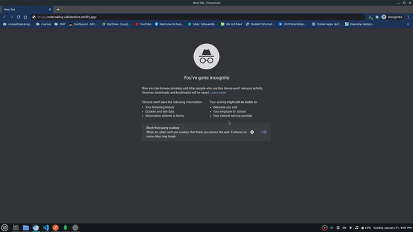

# :notebook: Note Taking Callobrative Web App

## :link: live demo : https://note-taking-callobrative.netlify.app

## a note taking app to :

### <ul>

### <li> user authentication</li>

### <li>adding note Body and Title</li>

### <li>edit notes</li>

### <li>share editable link so others can callobrate and edit notes together</li>

### </ul>

## Technnologies used

<ul>
<li>vanilla JS</li>
<li>web sockets</li>
<li>SahreDB for operational transformation synchorization</li>
</ul>

## project setup

> git clone https://github.com/bahaaEldeen1999/callobrative-Note-Taking-Frontend.git 
> cd Callobrative-Note-Taking-Frontend 
> run live server using any hosting tool

### this web app is based on operational transformation without causing conflicts or unwanted data it is based on techniques used in versioning systems that are used in Google Docs
